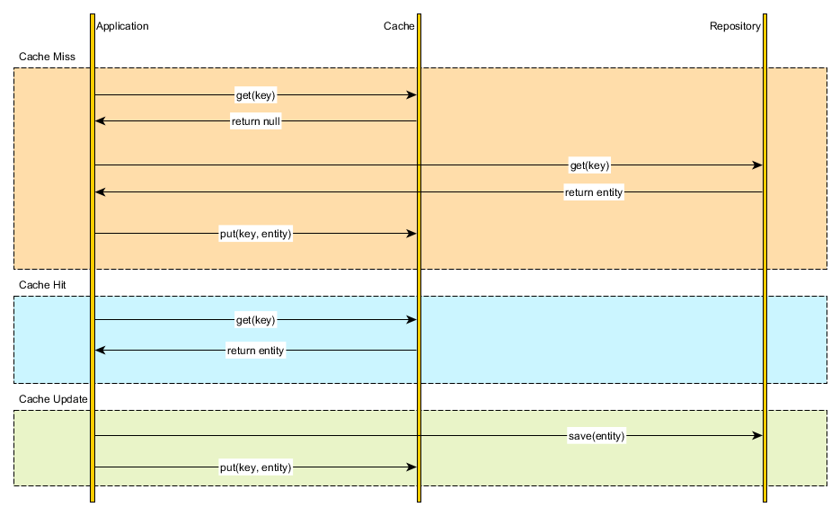
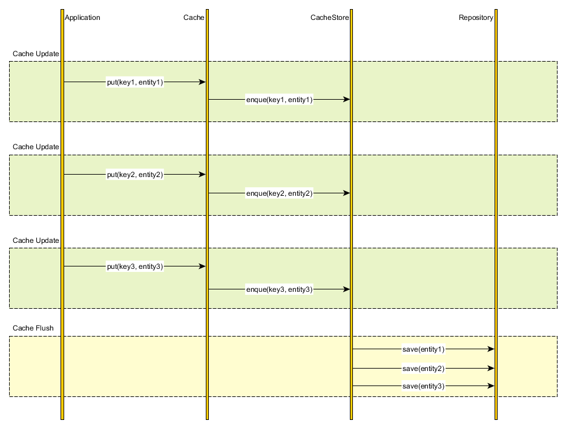

# Different Caching Approaches
 
## Introduction
 
In this report, we will learn about how different caching approaches affect the performance and scalability of an application. We will learn about the advantages and disadvantages of Cache-aside, Read-through, Write-through, and  Write-behind Caching.
First, we will study where we can implement caching. So, caching can be implemented at various levels like at the client, server, and database, etc.
 
### 1. Client Caching :
 
This caching is storing data in the local cache. Whenever data that is read from the server stored in the cache, and if the client wants to read this data again, it is taken from the cache instead of from the server.
 
 
### 2. Database Caching :
 
This caching is storing the result of the query is requested along with the query. If the query is requested again application checks if results are already stored in the cache.
 
 
### 3. Application Caching:
 
The application cache is used to fetch and store web resources. Loading resources from the cache is faster than loading from the network. When the browser needs resources, the application cache is checked, if resources were not found then browser download them from the network.
 
### 4. CDN Caching:
 
In Content Distribution Network(CDN) caching, static resources such as font, image, and videos are stored on servers that are more local to the user. It reduces the load on the application and network traffic.
 
Now, let us see the different type of cache strategies :
 
### 1. Cache-Aside :
 
* This is the most used cache strategy in applications and commonly known as lazy-loading. In this approach, the cache sits aside from the database. It is used with an application with read-heavy workloads.
 
* The application will first check in the cache, if data is found(cache-hit), then data is fetched from the cache and sent to the client.
 
* If data is not found(cache miss), then the application request the data directly from the database, and saves the copy of data in the cache and sent it to the client.
 

 
 
### 2. Read-Through:
 
* In this strategy, cache sits in between the application and database. This application can only request data from the cache.
 
* When data is not found in the cache, the only cache can fetch data from the database and update itself and return data to the application.
 

 
 
### 3. Write-Through:
 
* In this strategy, cache sits between application and database. The application treat cache as the data source to read and write.
 
* Cache is only responsible for storing and fetching data from the database.
 

 
 
### 4. Write-behind:
 
* It is the same as the write-through approach, it is used with the application with write-heavy loads.
 
* The application writes data in the cache, then the cache will update data in the database after some time, it improves write performance.
 

 
## Comparision
 
Approach | Advantages | Disadvantages
------------ | ------------- | -------------
Cache-Aside | * If the cache goes down, the application can directly access the database.   * Data model can be different between cache and database.  | * Every write operation is direct to the database.   * Cache data may become inconsistent.
Read-Through | * Works best in the read-heavy application when the same data is requested many times. | * When data is requested for the first time it always results in a cache miss.   * Cache data may become inconsistent.
Write-Through | * Data is always available in the cache.   * No data inconsistency if implemented with reading through approach | * Increase write latency because application writes to cache and then cache writes to the database.
Write-Behind | * Work best in write-heavy workloads   * Reduce a load of database | * If cache goes down, it results in permanent data loss.
 
 
 
 
 
## References:
 
* https://docs.microsoft.com/en-us/azure/cdn/cdn-how-caching-works
* https://vladmihalcea.com/a-beginners-guide-to-cache-synchronization-strategies/#:~:text=%20A%20beginner%E2%80%99s%20guide%20to%20Cache%20synchronization%20strategies,database%20and%20the%20cache%2C%20we%20can...%20More
* https://codeahoy.com/2017/08/11/caching-strategies-and-how-to-choose-the-right-one/
* https://blog.bluzelle.com/things-you-should-know-about-database-caching-2e8451656c2d
 

